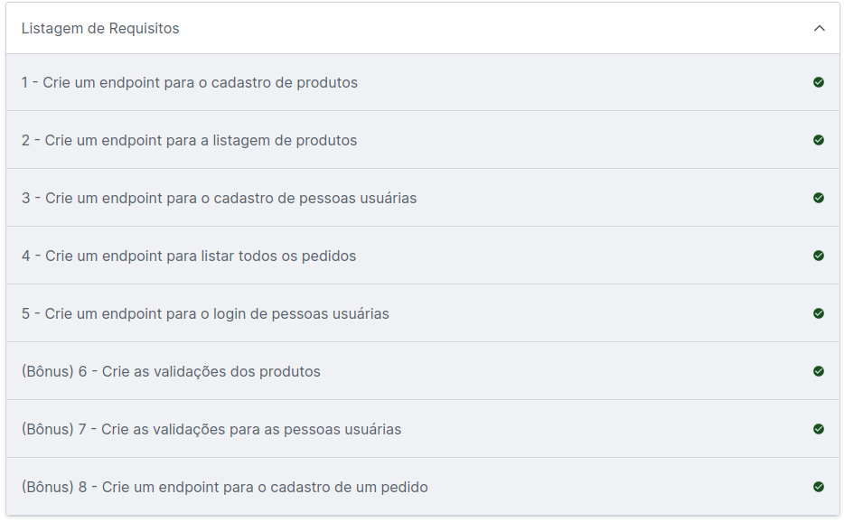

# Projeto - TrybeSmith

## 

## 💻 Projeto

O projeto tem como objetivo a criação de uma ApiRest de uma loja de itens medievais 

* Desenvolver uma ApiRest e implementar operações em CRUD (Create, Read, Update e Delete) de produtos e usuários utilizando Typescript;

## 🚀 Tecnologias

* JavaScript
* NodeJS
* Express
* Docker
* Typescript

## :memo: Aprendizados

* Criar rotas para cada operação em CRUD solicitada na regra de negócio do projeto;
* Implementação de Typescript para potencializar os códigos em Javascript,
  oferecendo vantagens como desempenho e produtividade devido a sua forte tipagem; 
* Aplicação de Middlewares para validações de usuários utilizando o JWT;
* Utilização da extensão Thunder Client para validar o funcionamento dos endpoints;

## 🛠 Instalação no Docker
Após clonar o repositório e acessar a pasta do projeto, execute:

 -> <code>docker-compose up -d</code>

Esse serviço irá inicializar um container chamado <code>trybesmith</code>.

A partir daqui você pode rodar o container via CLI.

 -> <code>docker exec -it trybesmith bash</code>.

Ele te dará acesso ao terminal interativo do container criado pelo compose, que está rodando em segundo plano.

Instale as dependências!

 -> <code>npm install</code>.

Execute a aplicação com <code>npm start</code> ou <code>npm run dev</code>.
